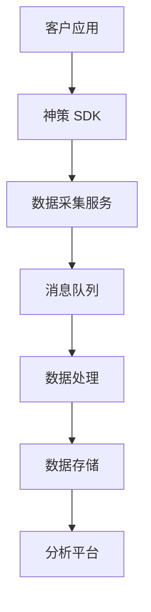
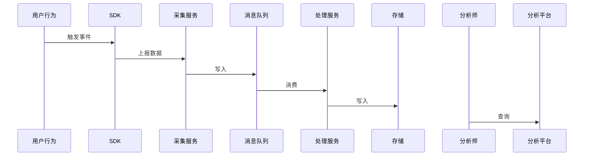

# 技术方案设计

## 适用场景

- 新客户项目启动，需要输出神策集成技术方案
- 客户内部架构评审，需要架构图和数据流图
- 方案变更时更新技术文档

## 核心原则（Iron Law）

**必须先理解客户的业务约束和技术现状，再输出方案。不允许在不了解客户环境的情况下直接套用标准架构。**

标准架构是起点，不是答案。

## 执行阶段

### Phase 1：需求与约束收集

收集以下信息：

| 类别 | 收集项 |
|------|--------|
| 业务规模 | 用户量、事件量、数据保留需求 |
| 技术栈 | 客户现有技术栈（语言、框架、云平台） |
| 集成要求 | 需要与哪些系统集成（CRM、广告平台、数仓等） |
| 部署约束 | 私有化 / SaaS / 混合，网络隔离要求 |
| 安全合规 | 数据脱敏要求、合规标准（等保、GDPR 等） |

### Phase 2：方案设计

基于收集的信息：
1. 确定部署模式（私有化 / SaaS）
2. 设计数据采集链路（SDK 类型、数据上报方式）
3. 设计数据流转路径（采集 → 处理 → 存储 → 分析）
4. 确定集成方案（API / SDK / 数据同步）
5. 识别风险点和应对措施

### Phase 3：Diagram 生成

使用 Mermaid 生成以下图表，根据客户实际情况调整内容：

**架构图（系统组件关系）：**


**数据流图（数据流转过程）：**


### Phase 4：技术方案文档输出

按以下结构输出文档：
1. 背景与目标
2. 技术架构（含架构图）
3. 数据流设计（含数据流图）
4. 集成方案
5. 部署要求（服务器配置、网络要求）
6. 风险与应对

## 输出模板

```
# [客户名] 神策数据集成技术方案

**版本：** v1.0
**日期：** YYYY-MM-DD
**作者：** ...

## 1. 背景与目标
...

## 2. 技术架构
[架构图]
...

## 3. 数据流设计
[数据流图]
...

## 4. 集成方案
...

## 5. 部署要求
...

## 6. 风险与应对
| 风险 | 影响 | 应对措施 |
|------|------|----------|
| ...  | ...  | ...      |
```

## 常见问题

**客户技术信息不完整：** 先输出基于标准假设的方案，在文档中明确标注假设项，要求客户确认。

**客户要求非标准架构：** 评估可行性后，在方案中说明与标准架构的差异和额外风险。

**Mermaid 图表太复杂：** 拆分为多个子图，每个子图聚焦一个关注点。
